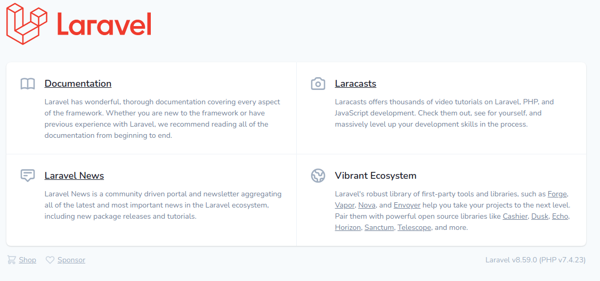

# Docker-Compose with Nginx & php & Mysql 

## Downloading Laravel and Installing Dependencies

- Downloading Laravel 

  ```bash
  git clone https://github.com/laravel/laravel.git laravel-app
  ```

- Move inside the folder

  ```bash
  cd laravel-app
  ```

- Install Dependencies

  ```bash
  composer install
  ```


## Creating the Docker Compose File

- Create docker-composer.yml file

  ```bash
  nano docker-compose.yml
  ```

- Write the services and network into the file

  ```yaml
  version: '3'
  services:
  
    #PHP Service
    app:
      build:
        context: .
        dockerfile: Dockerfile
      container_name: app
      restart: unless-stopped
      tty: true
      environment:
        SERVICE_NAME: app
        SERVICE_TAGS: dev
      working_dir: /var/www
      volumes:
        - ./:/var/www
        - ./php/local.ini:/usr/local/etc/php/conf.d/local.ini
      networks:
        - app-network
  
    #Nginx Service
    webserver:
      image: nginx:alpine
      container_name: webserver
      restart: unless-stopped
      tty: true
      ports:
        - "8088:80"
        - "443:443"
      volumes:
        - ./:/var/www
        - ./nginx/conf.d/:/etc/nginx/conf.d/
      networks:
        - app-network
  
    #MySQL Service
    db:
      image: mysql:5.7.22
      container_name: db
      command: --default-authentication-plugin=mysql_native_password
      restart: unless-stopped
      tty: true
      ports:
        - "3306:3306"
      environment:
        MYSQL_ROOT_PASSWORD: pass123
        MYSQL_DATABASE: laravel
        MYSQL_USER: "admin"
        MYSQL_PASSWORD: "pass123"
      volumes:
        - ./dbdata:/var/lib/mysql/
        - ./mysql/my.cnf:/etc/mysql/my.cnf
      networks:
        - app-network
  
    # phpmyadmin
    phpmyadmin:
      image: phpmyadmin
      container_name: pma
      restart: unless-stopped
      depends_on:
        - db
      environment:
        - PMA_ARBITRARY=1
      ports:
        - 8080:80
      networks: 
        - app-network
  
  
  #Docker Networks
  networks:
    app-network:
      driver: bridge
    
  #Volumes
  volumes:
    dbdata:
      driver: local
  ```


- Create the Dockerfile for php

  ```
  FROM php:7.4-fpm
  
  # Copy composer.lock and composer.json
  COPY composer.lock composer.json /var/www/
  
  # Set working directory
  WORKDIR /var/www
  
  # Install dependencies
  RUN apt-get update && apt-get install -y \
  build-essential \
  libpng-dev \
  libjpeg62-turbo-dev \
  libfreetype6-dev \
  locales \
  zip \
  jpegoptim optipng pngquant gifsicle \
  vim \
  unzip \
  git \
  curl
  
  # Clear cache
  RUN apt-get clean && rm -rf /var/lib/apt/lists/*
  
  # Install extensions
  # RUN docker-php-ext-install pdo_mysql mbstring zip exif pcntl
  # RUN docker-php-ext-configure gd --with-gd --with-freetype-dir=/usr/include/ --with-jpeg-dir=/usr/include/ --with-png-dir=/usr/include/
  # RUN docker-php-ext-install gd
  
  # Install composer
  RUN curl -sS https://getcomposer.org/installer | php -- --install-dir=/usr/local/bin --filename=composer
  
  # Add user for laravel application
  RUN groupadd -g 1000 www
  RUN useradd -u 1000 -ms /bin/bash -g www www
  
  # Copy existing application directory contents
  COPY . /var/www
  
  # Copy existing application directory permissions
  COPY --chown=www:www . /var/www
  
  # Change current user to www
  USER www
  
  # Expose port 9000 and start php-fpm server
  EXPOSE 9000
  CMD ["php-fpm"]
  ```

   

## Configuring PHP

- Create a local.ini file within the PHP folder

  ```bash
  nano php/local.ini
  ```

- Write into local.ini the following

  ```text
  upload_max_filesize=40M
  post_max_size=40M
  ```

## Configuring Nginx

- Create app.config file

  ```bash
  nano nginx/conf.d/app.conf
  ```

- Write into it the following

  ```text
  server {
      listen 80;
      index index.php index.html;
      error_log /var/log/nginx/error.log;
      access_log /var/log/nginx/access.log;
      root /var/www/public;
      location ~ \.php$ {
          try_files $uri =404;
          fastcgi_split_path_info ^(.+\.php)(/.+)$;
          fastcgi_pass app:9000;
          fastcgi_index index.php;
          include fastcgi_params;
          fastcgi_param SCRIPT_FILENAME $document_root$fastcgi_script_name;
          fastcgi_param PATH_INFO $fastcgi_path_info;
      }
      location / {
          try_files $uri $uri/ /index.php?$query_string;
          gzip_static on;
      }
  }
  ```

  

## Configuring MySQL

- Create my.cnf file

  ```
  nano mysql/my.cnf
  ```

- Write into it the following

  ```text
  upload_max_filesize=40M
  post_max_size=40M
  ```

## Modifying Environment Settings and Running the Containers

- copy of the .env.example file that Laravel includes by default and name the copy .env

  ```bash
  cp .env.example .env
  ```

- modify the .env file on the app container. In the file. we will add some specific details about our setup.

  ```text
  DB_CONNECTION=mysql
  DB_HOST=db
  DB_PORT=3306
  DB_DATABASE=laravel
  DB_USERNAME=admin
  DB_PASSWORD=pass123
  ```

- start all of the containers that are defined in our docker-compose file

  ```
  docker-compose up -d
  ```


